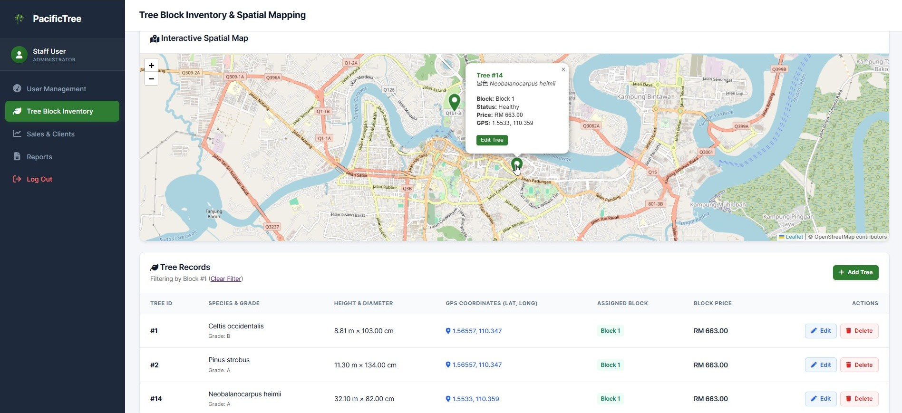

<div align="center">

# PacificTree: Enterprise GIS & Forestry Operations Platform

### A Full-Stack Spatial Mapping, Inventory & Commercial Management Platform

Spatial Mapping • Tree Inventory • Commercial Sales • Client Portal • Financial Analytics • Document Exports

---


</div>

---

# Overview

**PacificTree** is a full-stack enterprise web application designed for commercial forestry operations, spatial mapping, and digital timber asset tracking. 

The platform bridges the gap between field operations and commercial client management. It empowers staff administrators with real-time GIS mapping, tree block inventory tracking, and sales operations, while offering clients a dedicated portal to view acquisitions, monitor tree growth metrics, and track their investments.

---

## Dashboard Preview

<div align="center">
  
  <p><em>Tree Block Inventory & Interactive Spatial Mapping View (Staff Dashboard)</em></p>
</div>

---

## Project Evolution

This project is a direct full-stack web evolution of my initial **Tree Pacific Database System**. 

While the original system laid the foundational backend and database architecture, **PacificTree** expands the concept into a comprehensive, production-grade enterprise application by introducing:

- **Interactive GIS Spatial Mapping:** Transitioned from static database records to visual map rendering with Leaflet.js and OpenStreetMap.
- **Client & Staff Portals:** Implemented Role-Based Access Control (RBAC) to separate administrative field operations from client investment portfolios.
- **Commercial Operations:** Added tree block allocation, financial analytics, order processing, and automated document generation (PDF & Excel/CSV).
- **Modern Responsive UI/UX:** Built a sleek, accessible dashboard interface equipped with real-time analytics powered by Chart.js.

---

## Key Features

### Interactive GIS & Spatial Mapping
* **Real-time Map Coordinates:** Interactive map visualization powered by Leaflet.js and OpenStreetMap.
* **GPS Pin Positioning:** Custom tree location markers displaying species, health status, pricing, and exact GPS coordinates (latitude/longitude).
* **Reverse Geocoding:** Instant location identification and address mapping using the Nominatim API.

### Tree Block Inventory Management
* **Comprehensive CRUD Operations:** Track species names, grades, heights, diameters, health metrics, and block prices.
* **Block Assignment System:** Group individual trees into commercial blocks for structured inventory allocation.

### Commercial Operations & Client Portal
* **Role-Based Access Control (RBAC):** Distinct dashboards and access permissions tailored for Staff Administrators and Commercial Clients.
* **Sales & Block Allocation:** Seamless workflow for assigning tree blocks to client companies.
* **Client Portfolio Dashboard:** Dedicated client view to monitor order histories, acquired tree blocks, and tree growth metrics.

### Reports & Financial Analytics
* **Visual Dashboards:** Real-time revenue distribution charts, inventory status gauges, and portfolio valuations built with Chart.js.
* **Automated Document Exports:** Downloadable PDF reports (via DomPDF) and Excel/CSV spreadsheets (via PhpSpreadsheet) for offline auditing.

---

# Tech Stack & Dependencies

## Backend
- **PHP** (OOP Architecture)
- **MySQL / MariaDB**

## Frontend
- **CSS3**
- **JavaScript** 
- **FontAwesome Icons**

## Spatial Mapping & Visualization
- **Leaflet.js** (Interactive Maps)
- **OpenStreetMap API & Nominatim** (Geocoding)
- **Chart.js** (Data & Financial Analytics)

## PHP Libraries (via Composer)
- **`dompdf/dompdf`** — Automated PDF document generation
- **`phpoffice/phpspreadsheet`** — Excel (`.xlsx`) and CSV spreadsheet exports

---

# Project Structure

```text
PacificTree/
├── assets/
│   └── inventory-map.png # Snapshot for README
├── database/
│   └── tree.sql
├── src/
│   ├── config/
│   │   └── db.php
│   ├── controllers/
│   ├── models/
│   └── views/
│       ├── client/
│       ├── staff/
│       └── public/
├── vendor/               # Excluded via .gitignore (managed via Composer)
├── composer.json
├── composer.lock
└── README.md
Feel free to learn from, fork, and adapt this project for your own builds.

```
---

If you found this project interesting, consider giving it a star!

Made with ❤️ by [mdhamka](https://github.com/mdhamka)
